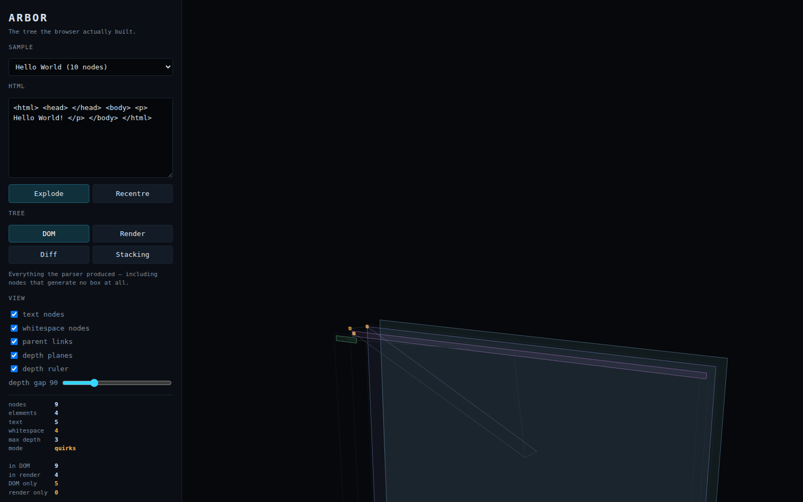
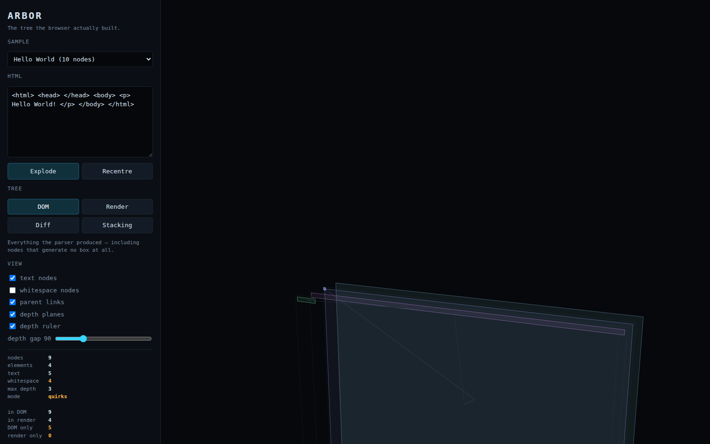
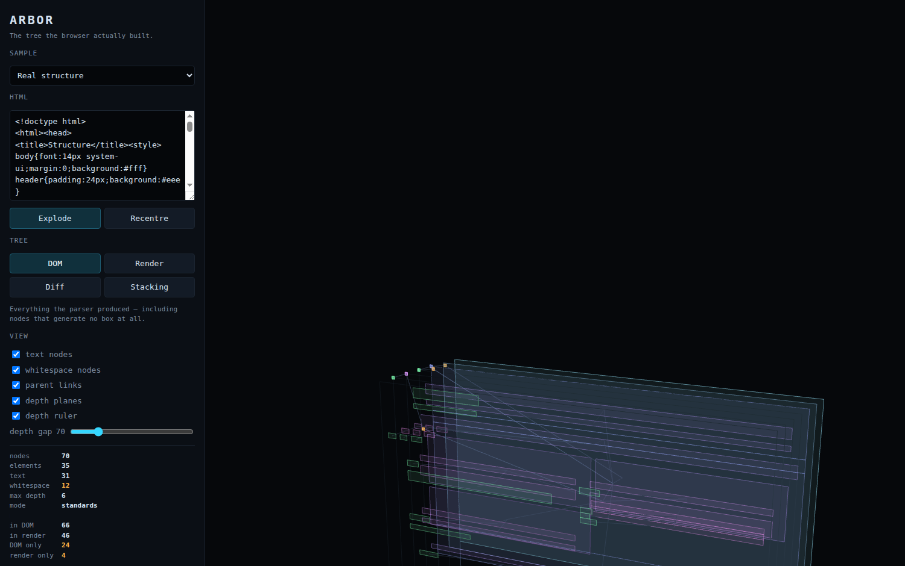
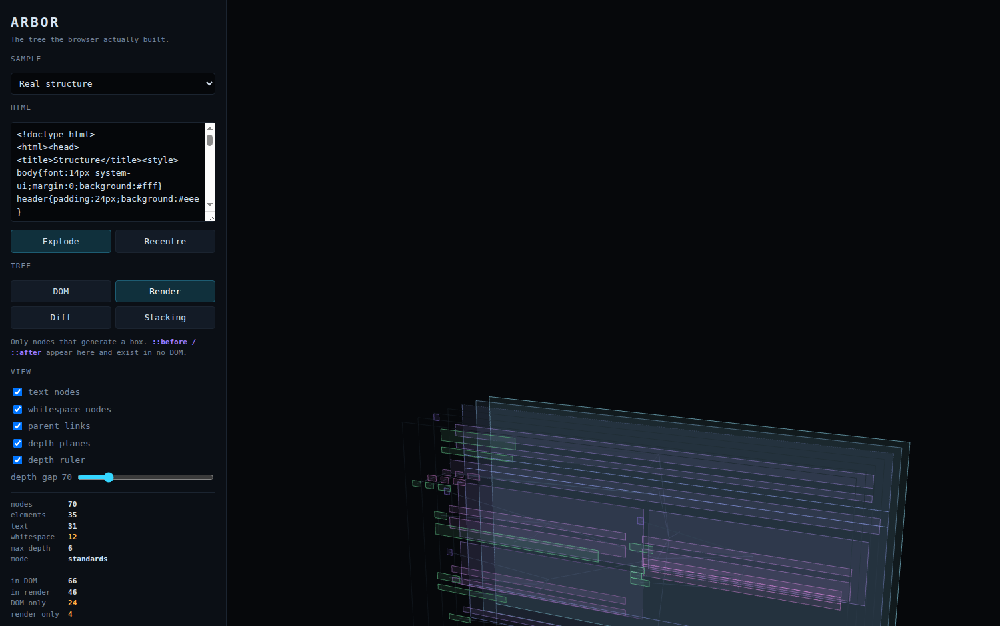
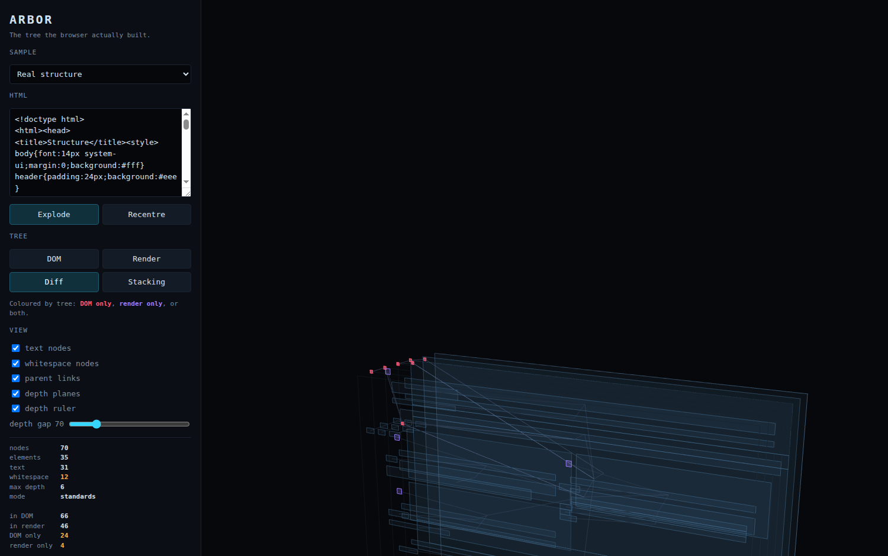
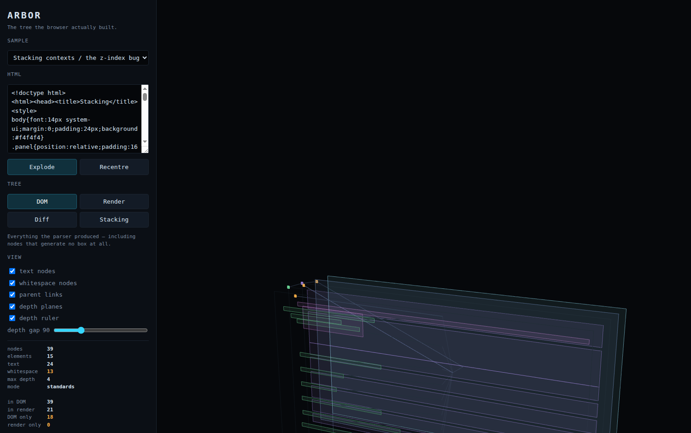
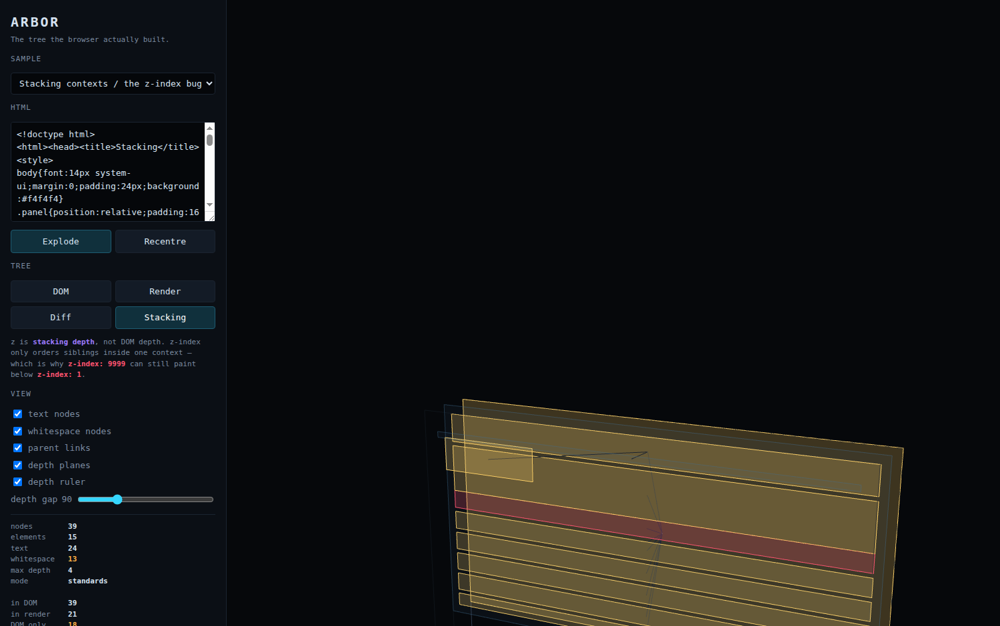
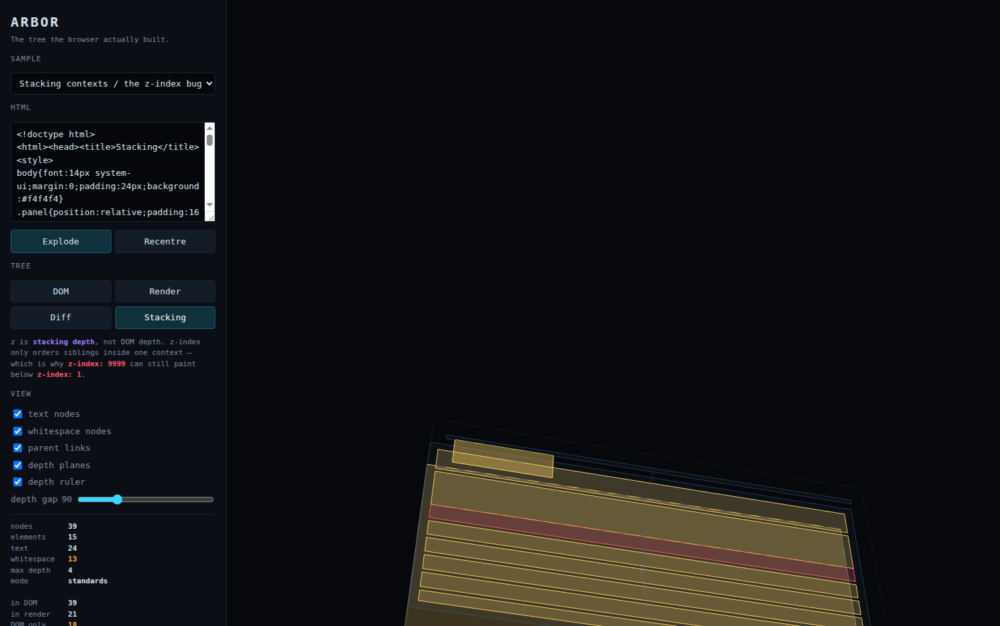

# snaps/ — a visual walkthrough

Captured 2026-08-01 at 1500×940 against the dev server. Every number quoted below is read
off the panel in the shot itself, not from memory.

The point of this folder: **show what is in the code, what is on screen, and how far apart
those two things are.**

> **A note on counting.** Arbor walks from `document.documentElement`, so its totals start at
> `<html>` and exclude the `Document` node itself. The README's "ten nodes" for Hello World
> counts `Document`; the panel says **9** for the same page. Same tree, different starting
> point.

---

## 01 — `01-hello-dom.png` · four tags in, nine nodes out



Source, in full:

```html
<html> <head> </head> <body> <p> Hello World! </p> </body> </html>
```

Panel reports:

```
nodes 9 · elements 4 · text 5 · whitespace 4 · max depth 3 · mode quirks
in DOM 9 · in render 4 · DOM only 5
```

**Four elements and one string produce nine nodes, and four of them are whitespace** — the
orange markers. One of those sits directly between `<head>` and `<body>` as a child of
`<html>`, which most people would say is impossible.

`mode quirks` is the other invisible fact: no doctype, so the box model is the legacy one.
Nothing in the source says so.

Note `in render 4` against `in DOM 9`. **Less than half this document paints anything** —
`<head>` and everything in it is `display: none` by the UA stylesheet, and the collapsed
whitespace generates no boxes.

## 02 — `02-hello-no-whitespace.png` · the same tree, whitespace hidden



Identical page, `whitespace nodes` unchecked. This is the tree people *think* they wrote.
Flipping between 01 and 02 is the fastest way to see the gap.

The counts in the panel do not change — nothing was removed from the capture, only from the
render. The data is always the full truth; the toggles decide how much of it you look at.

---

## 03 — `03-structure-dom.png` · a real document, DOM tree



```
nodes 70 · elements 35 · text 31 · whitespace 12 · max depth 6 · mode standards
in DOM 66 · in render 46 · DOM only 24 · render only 4
```

A page with a header, nav, a CSS grid of cards, a footer, a `<script>`, one `display: none`
section and one `visibility: hidden` section. Everything the parser produced is here.

Depth 6 with only ~35 elements — nesting accumulates faster than it reads in source.

## 04 — `04-structure-render.png` · the same page, render tree



Same capture, `Render` mode: only nodes that generate a box. **24 nodes vanish.** Gone are
`<head>`, `<title>`, `<style>`, `<script>`, the entire `display: none` section *including
its children*, and the whitespace layout collapsed.

The `visibility: hidden` section is **still here** — it generates a box and occupies space,
it merely isn't painted. That is the whole difference between the two properties, and it is
visible rather than memorised.

Four nodes appear that were not in the DOM tree: the `::before` pseudo-elements on the cards.

## 05 — `05-structure-diff.png` · both trees at once



The same 70 nodes, coloured by membership instead of depth:

- **blue** — in both trees (46)
- **red** — in the DOM, no box (24). The cluster top-left is `<head>` and its contents
- **purple** — a box in no DOM (4). `::before` on each card

Hue is spent entirely on membership here, and depth falls back to the z axis alone. Encoding
two variables on one channel is what turns this kind of view to mush.

---

## 06 — `06-stacking-sample-dom.png` · the z-index page, DOM tree



```
nodes 39 · max depth 4 (DOM) · stack ctxs 9 · stack depth 3 · dead z-index 1
```

The stacking sample seen as an ordinary DOM tree. z here is **nesting depth** — nothing about
this view hints that layering is broken.

## 07 — `07-stacking-tree.png` · the same page, stacking tree



Same nodes, but **z is now stacking depth, not DOM depth** — max DOM depth 4, max stacking
depth 3, and they are not the same nodes at the same levels. Watching them diverge is the
point of this mode.

- **gold** — forms a stacking context (9 of them)
- **blue** — merely paints inside one
- **red** — `z-index` set but inert (1)

Parent links now point at each node's **containing context**, not its DOM parent, so links
leap across DOM levels to whichever ancestor actually formed one.

## 08 — `08-hover-z9999.png` · the bug, named



Hovering `div.boosted`, the readout says:

```
div.boosted
tree      DOM + render
depth     3   (DOM)
stacking  FORMS A CONTEXT — position:absolute + z-index:9999
box       65, 69  280 x 90
display   block   position absolute   z 9999
```

This element carries `z-index: 9999` and still paints **below** a sibling with `z-index: 1`,
because its parent set `opacity: .99` — a change nobody can see — which sealed it into its
own stacking context. z-index only orders siblings within one context; no value escapes it.

The panel's `dead z-index 1` is a separate case: `z-index: 500` on a `position: static`
element, silently ignored because the property does not apply there.

---

## 09 / 10 — reference geometry off, then on


The same capture, same camera. Without reference geometry, translucent planes in perspective
give the eye nothing to measure against — you cannot tell small-and-near from large-and-far,
and "how deep is this" is unanswerable.

With it: the page outline at z = 0 is a fixed known rectangle, a faint frame marks every
depth level, and a numbered ruler turns distance into a figure. All in one flat colour, so
reference never competes with data.

---

## Regenerating

These were captured through a driving browser. `tools/snap.mjs` reproduces them:

```bash
npm i -D playwright     # the browser binary is usually already cached
npm run dev             # in another terminal
node tools/snap.mjs
```

Playwright is deliberately **not** a committed dependency — it is a heavy install for
something that runs by hand a few times a release.
